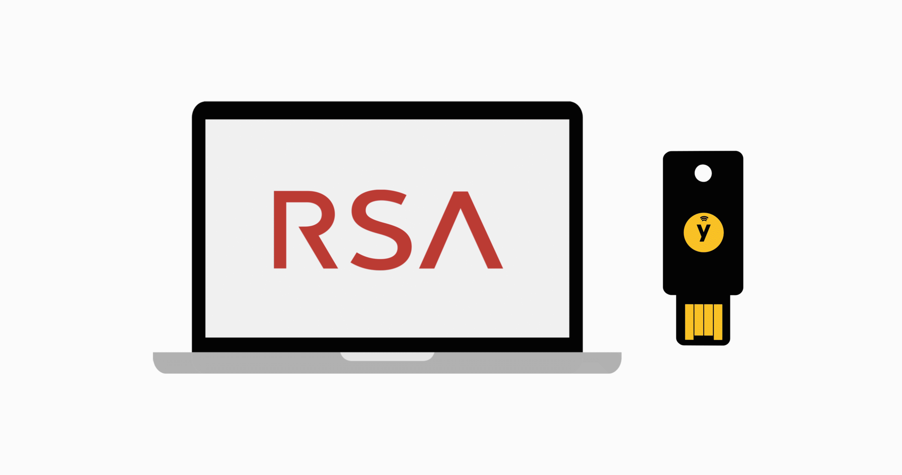

<div align="center">

# RSA - factoring challenge

We have sniffed an unsecured network and found numbers that are used to encrypt very important documents. It seems that those numbers are not always generated using large enough prime numbers. Your mission should you choose to accept it, is to factorize these numbers as fast as possible before the target fixes this bug on their server - so that we can decode the encrypted documents

---

# RESOURCES :books:

</div>

- [RSA](https://intranet.hbtn.io/rltoken/bkohLbiGqDEExwdQR0bcwA)
- [How does HTTPS provide security?](https://stackoverflow.com/questions/3968095/how-does-https-provide-security)
- [Prime Factorization](https://privacycanada.net/mathematics/prime-factorization/)


## USAGE

```
./<script> <Test Case>
```

## KNOWN ISSUE :adhesive_bandage:

 - Not complete, still working on the task

### AUTHOR

* [Nicks](https://github.com/nickssilver) :smiley_cat:
